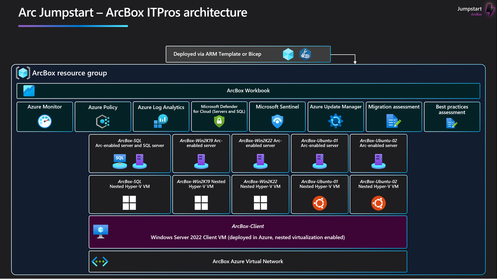
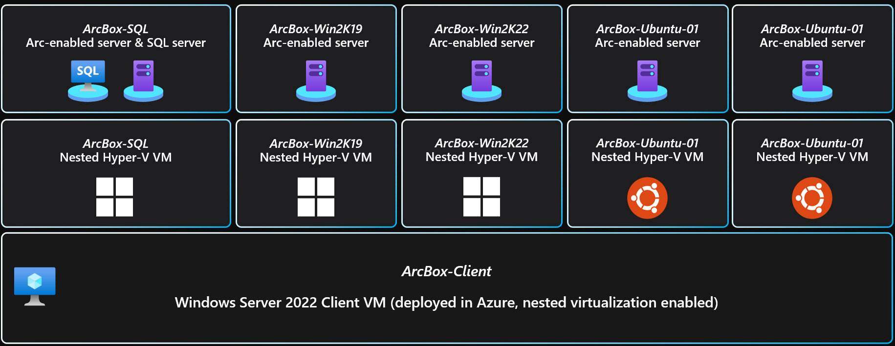
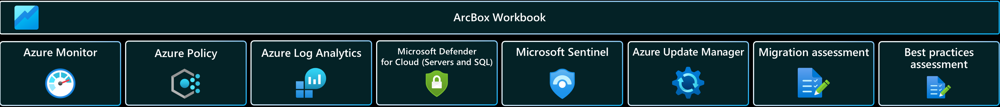

# Et oui, c'est bien vide ici ! 

Mais c'est normal ! Pour ce workshop, nous allons nous baser sur la box Arc, mise à disposition sur https://azurearcjumpstart.io/. Je te rassure, nous n'allons pour TOUT faire (à moins que tu ais une semaine devant toi). Non, nous allons nous concentrer sur les scénarios qui suivent:

## Déploiement de l'ArcBox

Pour commencer, nous allons déployer "l'ArcBox for IT pros".

ArcBox for IT Pros est une version spéciale d’ArcBox destinée aux utilisateurs qui souhaitent découvrir les capacités des serveurs activés par Azure Arc dans un environnement de test.

### Usage

- Un environnement de test pour se familiariser avec les technologies Azure Arc
- un accélérateur de POC pour les preuves de concept ou les projets pilotes
- un outil de formation pour le développement des compétences Azure Arc
- un environnement de démonstration
- une plateforme de test d’intégration rapide
- Bibliothèque de modèles d’infrastructure-as-code et d’automatisation pour la création de solutions de gestion de cloud hybride

## Les fonctionnalités disponibles

### Azure Arc-enabled servers

ArcBox comprend trois serveurs gérés par Azure Arc qui sont hébergées en utilisant la virtualisation imbriquée dans Azure. Dans le cadre du déploiement, un hôte Hyper-V (ArcBox-Client) est déployé avec trois machines virtuelles invitées. Ces machines, ArcBoxWin, ArcBoxUbuntu et ArcBoxSQL, sont connectées en tant que serveurs gérés par Azure Arc via l’automatisation de l'ArcBox

ERRATUM :
Dans la partie acivation des providers azure, il faut rajouter :

Microsoft.Insights
Microsoft.HybridConnectivity

### Unified Operations

ArcBox déploie plusieurs services de gestion et d’opérations qui fonctionnent avec les ressources Azure Arc d’ArcBox. Ces ressources comprennent un espace de travail Azure Log Analytics, un workbook Azure Monitor, des policies Azure pour déployer des agents Azure Monitor sur les serveurs Windows et Linux activés par Azure Arc, une policy Azure pour ajouter des balises aux ressources, et un compte de stockage utilisé pour la mise en scène des ressources nécessaires à l’automatisation du déploiement

=> Suis le scénario proposé de bout en bout : https://azurearcjumpstart.io/azure_jumpstart_arcbox/ITPro

##plongeons dans le vif du sujet

Ca y est, ta box est déployée, on va pouvoir creuser un peu le sujet, et ce sera par là : [Unified Operations Use Cases](https://azurearcjumpstart.io/azure_arc_jumpstart/azure_arc_servers/day2)

